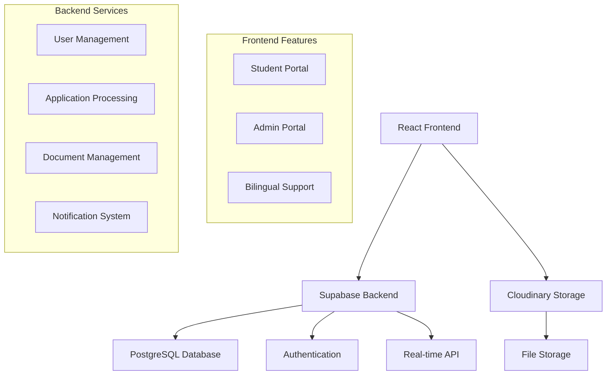

# 🎓 RGA Scholarship Management System

<div align="center">


**A modern, full-stack scholarship management platform built for RGA Swarna Jayanti Shiksha Nyas**

[](https://reactjs.org/)
[](https://www.typescriptlang.org/)
[](https://supabase.com/)
[](https://tailwindcss.com/)
[](https://wasabi.com/)

[🚀 Live Demo](#) • [📖 Documentation](#features) • [🛠️ Installation](#installation) • [🤝 Contributing](#contributing)

</div>

---

## 🌟 Overview

The **RGA Scholarship Management System** is a comprehensive digital platform designed to streamline scholarship applications, management, and distribution for the Rajasthani Graduate Association (RGA) Swarna Jayanti Shiksha Nyas. This system bridges the gap between deserving students and educational opportunities through a modern, user-friendly interface.

### 🎯 Problem Statement

Traditional scholarship management involves:
- ❌ Paper-based applications prone to loss
- ❌ Manual review processes causing delays
- ❌ Limited transparency in application status
- ❌ Difficulty in document management
- ❌ Language barriers for Hindi-speaking students
- ❌ Inefficient communication between admins and students

### ✅ Our Solution

A digital-first approach that provides:
- ✅ **Paperless Applications**: Complete digital workflow
- ✅ **Real-time Tracking**: Live application status updates
- ✅ **Bilingual Support**: Full English and Hindi interface
- ✅ **Cloud Storage**: Secure document management with Wasabi
- ✅ **Role-based Access**: Separate interfaces for students and administrators
- ✅ **Automated Workflows**: Streamlined review and approval processes

---

## 🚀 Features

### 👨‍🎓 Student Portal

<details>
<summary><strong>🏠 Interactive Dashboard</strong></summary>

- **Quick Stats**: View application status at a glance
- **Available Scholarships**: Browse and apply to active scholarship programs
- **Application History**: Track all submitted applications
- **Success Metrics**: Personal achievement tracking
- **Quick Actions**: One-click access to key features

</details>

<details>
<summary><strong>📝 Dynamic Application System</strong></summary>

- **Smart Forms**: Dynamic form generation based on admin configurations
- **Multi-step Process**: Guided application workflow
- **Auto-save**: Draft saving functionality
- **Field Validation**: Real-time form validation
- **File Uploads**: Secure document upload to Wasabi cloud storage

</details>

<details>
<summary><strong>📁 Document Management</strong></summary>

- **Cloud Storage**: All documents stored securely on Cloudinary
- **File Organization**: Automatic categorization and tagging
- **Multiple Formats**: Support for PDF, DOC, DOCX, and images
- **Download/Preview**: Easy document access and viewing
- **Version Control**: Track document updates and changes

</details>

<details>
<summary><strong>📊 Application Tracking</strong></summary>

- **Real-time Status**: Live updates on application progress
- **Status History**: Complete timeline of application changes
- **Admin Notes**: View feedback and comments from reviewers
- **Notifications**: Email alerts for status changes

</details>

### 👨‍💼 Admin Portal

<details>
<summary><strong>📈 Comprehensive Dashboard</strong></summary>

- **Analytics Overview**: Key metrics and statistics
- **Recent Activity**: Latest application submissions
- **Quick Actions**: Fast access to common admin tasks
- **Performance Metrics**: Success rates and approval statistics

</details>

<details>
<summary><strong>🛠️ Dynamic Form Builder</strong></summary>

- **Drag & Drop**: Intuitive form creation interface
- **Field Types**: Text, number, email, phone, date, file, select, textarea
- **Validation Rules**: Custom validation for each field
- **Bilingual Support**: Create forms in both English and Hindi
- **Preview Mode**: Test forms before publishing

</details>

<details>
<summary><strong>📋 Application Management</strong></summary>

- **Bulk Operations**: Process multiple applications simultaneously
- **Advanced Filtering**: Filter by status, date, form type, etc.
- **Detailed Review**: Complete application view with all documents
- **Status Management**: Approve, reject, or hold applications
- **Notes System**: Add internal notes and feedback

</details>

<details>
<summary><strong>📢 Announcement System</strong></summary>

- **Marquee Messages**: Scrolling announcements on student portal
- **Bilingual Announcements**: Support for English and Hindi messages
- **Scheduling**: Set active/inactive status for announcements
- **Rich Content**: Support for formatted text and links

</details>

<details>
<summary><strong>📊 Data Export & Analytics</strong></summary>

- **CSV Export**: Export application data in various formats
- **Custom Reports**: Generate reports based on specific criteria
- **Statistical Analysis**: Comprehensive analytics dashboard
- **Data Visualization**: Charts and graphs for better insights

</details>

---

## 🛠️ Technology Stack

### Frontend
- **⚛️ React 18.3.1** - Modern UI library with hooks
- **🔷 TypeScript 5.5.3** - Type-safe JavaScript
- **🎨 Tailwind CSS 3.4.1** - Utility-first CSS framework
- **🧭 React Router 6.20.1** - Client-side routing
- **📝 React Hook Form 7.48.2** - Efficient form handling
- **🔥 React Hot Toast 2.4.1** - Beautiful notifications
- **🎯 Lucide React 0.344.0** - Beautiful icons

### Backend & Database
- **🗄️ Supabase** - Backend-as-a-Service platform
  - PostgreSQL database
  - Real-time subscriptions
  - Row Level Security (RLS)
  - Authentication & authorization
- **☁️ Cloudinary** - Cloud-based media management and optimization
- **🔐 JWT Authentication** - Secure user authentication

### Development Tools
- **⚡ Vite 5.4.2** - Fast build tool and dev server
- **📏 ESLint** - Code linting and formatting
- **🎯 PostCSS & Autoprefixer** - CSS processing

### Cloud Infrastructure
- **🌐 Cloudinary** - Primary file storage and media management
- **🔒 Supabase** - Database and authentication
- **📡 Real-time Updates** - Live data synchronization

---

## 🏗️ Architecture



---

## 📱 Screenshots

<div align="center">

### 🏠 Landing Page
*Beautiful, responsive landing page with bilingual support*

### 👨‍🎓 Student Dashboard
*Intuitive dashboard showing available scholarships and application status*

### 📝 Application Form
*Dynamic, multi-step application forms with real-time validation*

### 👨‍💼 Admin Dashboard
*Comprehensive admin interface with analytics and management tools*

### 📊 Analytics View
*Detailed statistics and reporting capabilities*

</div>

---

## 🚀 Installation

### Prerequisites
- Node.js 18+ and npm
- Supabase account
- Cloudinary account

### 1. Clone the Repository
```bash
git clone https://github.com/yourusername/rga-scholarship-system.git
cd rga-scholarship-system
```

### 2. Install Dependencies
```bash
npm install
```

### 3. Environment Setup
Create a `.env` file in the root directory:

```env
# Supabase Configuration
VITE_SUPABASE_URL=your_supabase_project_url
VITE_SUPABASE_ANON_KEY=your_supabase_anon_key

# Cloudinary Configuration
VITE_CLOUDINARY_CLOUD_NAME=your_cloud_name
VITE_CLOUDINARY_UPLOAD_PRESET=student_upload
```

### 4. Database Setup
Run the Supabase migrations:
```bash
# The migrations are located in supabase/migrations/
# Apply them through Supabase CLI or dashboard
```

### 5. Start Development Server
```bash
npm run dev
```

Visit `http://localhost:5173` to see the application running!

---

## 🗄️ Database Schema

<details>
<summary><strong>📊 Core Tables</strong></summary>

- **`users`** - User accounts with role-based access
- **`profiles`** - Extended user profile information
- **`scholarship_forms`** - Dynamic form templates
- **`form_fields`** - Configurable form field definitions
- **`applications`** - Student scholarship applications
- **`application_responses`** - Student responses to form fields
- **`documents`** - File metadata and Wasabi URLs
- **`announcements`** - System-wide announcements

</details>

<details>
<summary><strong>🔐 Security Features</strong></summary>

- **Row Level Security (RLS)** on all tables
- **Role-based access control** (Student/Admin)
- **JWT authentication** with Supabase Auth
- **Secure file uploads** with Cloudinary
- **Data validation** at database level

</details>

---

## 🌍 Internationalization

The system supports full bilingual functionality:

- **🇬🇧 English** - Primary language
- **🇮🇳 Hindi** - Complete Hindi translation
- **Dynamic Language Switching** - Users can switch languages anytime
- **Localized Content** - Forms, announcements, and UI elements
- **RTL Support Ready** - Architecture supports right-to-left languages

---

## 🔧 Configuration

### Supabase Setup
1. Create a new Supabase project
2. Run the provided migrations
3. Configure authentication providers
4. Set up Row Level Security policies

### Cloudinary Setup
1. Create a Cloudinary account
2. Get your cloud name from the dashboard
3. Create an unsigned upload preset named 'student_upload'
4. Configure upload settings and security

### Environment Variables
All configuration is handled through environment variables for security and flexibility.

---

## 📈 Performance Features

- **⚡ Fast Loading** - Optimized with Vite and code splitting
- **📱 Mobile Responsive** - Works perfectly on all devices
- **🔄 Real-time Updates** - Live data synchronization
- **💾 Caching** - Smart data caching and Cloudinary CDN
- **🗜️ Optimized Assets** - Compressed images and minified code
- **🚀 CDN Ready** - Optimized for content delivery networks

---

## 🧪 Testing

```bash
# Run tests
npm run test

# Run tests with coverage
npm run test:coverage

# Run E2E tests
npm run test:e2e
```

---

## 🚀 Deployment

### Build for Production
```bash
npm run build
```

### Deploy to Vercel
```bash
npm install -g vercel
vercel --prod
```

### Deploy to Netlify
```bash
npm run build
# Upload dist/ folder to Netlify
```

---

## 🤝 Contributing

We welcome contributions! Please see our [Contributing Guidelines](CONTRIBUTING.md) for details.

### Development Workflow
1. Fork the repository
2. Create a feature branch
3. Make your changes
4. Add tests if applicable
5. Submit a pull request

### Code Style
- Use TypeScript for all new code
- Follow the existing code style
- Use meaningful commit messages
- Add comments for complex logic

---

## 📄 License

This project is licensed under the MIT License - see the [LICENSE](LICENSE) file for details.

---

## 👥 Team

<div align="center">

**Built with ❤️ for educational empowerment**

### 🏢 RGA Swarna Jayanti Shiksha Nyas
*Empowering Education, Transforming Lives*

</div>

---

## 📞 Support

- **📧 Email**: support@rga.org
- **🌐 Website**: [https://rga-scholarship.org](https://rga-scholarship.org)
- **📱 Phone**: +91 98765 43210

---

## 🙏 Acknowledgments

- **RGA Community** - For their vision and support
- **Open Source Contributors** - For the amazing tools and libraries
- **Students and Educators** - For their feedback and testing
- **Supabase Team** - For the excellent backend platform
- **Cloudinary** - For powerful media management and optimization

---

<div align="center">

**⭐ Star this repository if you found it helpful!**

[](https://github.com/yourusername/rga-scholarship-system/stargazers)
[](https://github.com/yourusername/rga-scholarship-system/network/members)

**Made with 💻 and ☕ by the RGA Development Team**

</div>